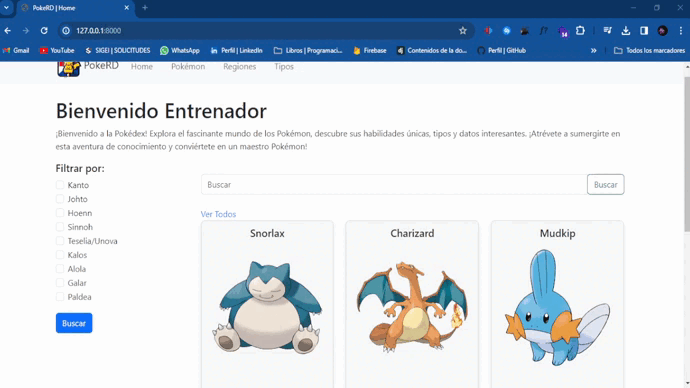
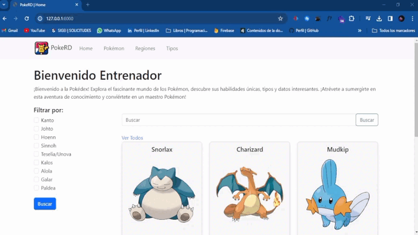
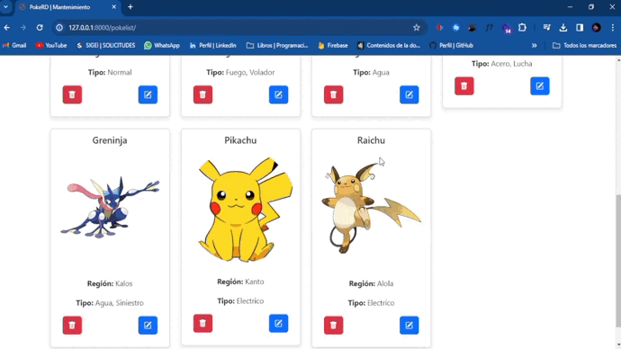
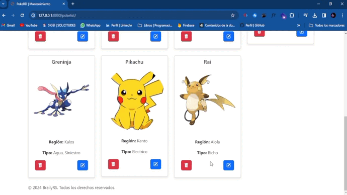

<h1 align="center"> PokeRD </h1>
<p align="center"></p> 

## Tabla de contenidos:
- [Descripción y contexto](#descripción-y-contexto)
- [Guía de usuario](#guía-de-inst)
- [Guía de instalación](#guía-de-instalación)
- [Información adicional](#información-adicional)
- [Autor/es](#autores)


## Descripción y contexto
PokeRD es un miniproyecto desarrollado en un lapso de tres días, concebido como una práctica para fortalecer habilidades en el desarrollo backend utilizando el framework Django. Este proyecto cuenta con funcionalidades clave que permiten a los usuarios agregar, editar y eliminar información relacionada con pokémons, incluyendo detalles sobre tipos y regiones.

## Guía de instalación

### Buscador:
Este nos permitira buscar pokemons mediante su nombre. luego de haber buscado el pokemon que querias puedes darle al boton ***Ver Todos*** para volver a ver todos los pokemons.


### Filtrado por checkbox:
Esta funcion nos permite filtrar los pokemons segun la region que se marque en el checkbox.(Puedes marcar mas de una region)


### Agregar Pokemon:


### Editar Pokemon


### Eliminar Pokemon


## Guia de Instalacion 
La herramienta digital tiene varias dependencias esenciales que son necesarias para su correcto funcionamiento. A continuación, se proporciona una descripción de estas dependencias, incluyendo versiones, descripciones y comandos de instalación.

1. **asgiref (v3.7.2):**
   - *Descripción:* Biblioteca para manejar la comunicación asincrónica en aplicaciones web.
   - *Licencia:* BSD.
   - *Última Versión Probada:* 3.7.2.
   - *Comando de Instalación:*
     ```bash
     pip install asgiref==3.7.2
     ```

2. **Django (v5.0.1):**
   - *Descripción:* Framework web de alto nivel y de código abierto escrito en Python.
   - *Licencia:* BSD.
   - *Última Versión Probada:* 5.0.1.
   - *Comando de Instalación:*
     ```bash
     pip install Django==5.0.1
     ```

3. **Pillow (v10.2.0):**
   - *Descripción:* Biblioteca de procesamiento de imágenes que agrega capacidades de procesamiento de imágenes a su intérprete de Python.
   - *Licencia:* Python Imaging Library (PIL).
   - *Última Versión Probada:* 10.2.0.
   - *Comando de Instalación:*
     ```bash
     pip install pillow==10.2.0
     ```

4. **sqlparse (v0.4.4):**
   - *Descripción:* Analizador de SQL para Python.
   - *Licencia:* MIT.
   - *Última Versión Probada:* 0.4.4.
   - *Comando de Instalación:*
     ```bash
     pip install sqlparse==0.4.4
     ```

5. **tzdata (v2023.4):**
   - *Descripción:* Base de datos de zonas horarias utilizada por varios programas y sistemas.
   - *Licencia:* IANA Time Zone Database.
   - *Última Versión Probada:* 2023.4.
   - *Comando de Instalación:*
     ```bash
     pip install tzdata==2023.4
     ``` 

6. **Instal las dependencias:**
    ```bash
     pip install > requirements.txt
     ``` 

## Información adicional
Este proyecto esta contruido con la arquitectura MVT(Modelo Vista Template) esta es una variacion del MVC(Modelo Vista Controlador).

## Autor/es
 [Braily_rs35](https://www.instagram.com/braily_rs35/ "Braily_rs35")

  brailyrs03@gmail.com

